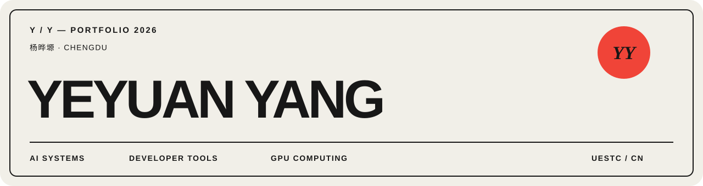

  

  <a href="mailto:2776079516@qq.com">Email</a>
  &nbsp;·&nbsp;
  <a href="https://www.uestc.edu.cn/">UESTC</a>
  &nbsp;·&nbsp;
  Chengdu, China

 

## Build useful things. Learn the hard parts.

I'm **Yeyuan Yang**, an Information and Communication Engineering student at UESTC. I work at the intersection of **developer tools**, **AI systems**, and **GPU computing** — turning technical ideas into small, useful products.

<table>
  <tr>
    <td width="33%" valign="top">
      NOW / 01 
      <strong>Agent workflows</strong> 
      Making multi-project and long-running agent work easier to understand.
    </td>
    <td width="33%" valign="top">
      NOW / 02 
      <strong>ML systems</strong> 
      Learning autograd, inference systems, and performance from first principles.
    </td>
    <td width="34%" valign="top">
      NOW / 03 
      <strong>Open-source products</strong> 
      Shipping focused tools that solve a real problem without unnecessary complexity.
    </td>
  </tr>
</table>

## Selected work

<table>
  <tr>
    <td width="50%" valign="top">
      01 / LOCAL-FIRST AI
      <h3><a href="https://github.com/shsaihdsaiudh/project-tracter">Project Tracker ↗</a></h3>
      
Tracks context across coding projects and turns daily work into AI-generated notes for Obsidian.

      
<code>TypeScript</code> <code>Local-first</code> <code>AI</code>

    </td>
    <td width="50%" valign="top">
      02 / LLM SERVING
      <h3><a href="https://github.com/shsaihdsaiudh/AgentKV">AgentKV ↗</a></h3>
      
Agent-aware prefix-cache retention for vLLM, reducing redundant prefill by 31% on a real GPU engine.

      
<code>Python</code> <code>vLLM</code> <code>KV Cache</code>

    </td>
  </tr>
  <tr>
    <td width="50%" valign="top">
      03 / FULL-STACK PRODUCT
      <h3><a href="https://github.com/shsaihdsaiudh/interview">Interview ↗</a></h3>
      
A campus mock-interview matching platform built as a complete web product.

      
<code>Go</code> <code>React</code> <code>PostgreSQL</code>

    </td>
    <td width="50%" valign="top">
      04 / GPU SYSTEMS
      <h3><a href="https://github.com/shsaihdsaiudh/cuda-graph-manager">Graph Tuner ↗</a></h3>
      
Selects workload-aware CUDA graph capture sets for vLLM, cutting graph memory by 62% at comparable latency.

      
<code>Python</code> <code>vLLM</code> <code>CUDA</code>

    </td>
  </tr>
</table>

## Working stack

`Python` &nbsp; `TypeScript` &nbsp; `Go` &nbsp; `C++` &nbsp; `CUDA` &nbsp; `PyTorch` &nbsp; `Docker` &nbsp; `Linux`

---

  Build in public. Keep the work useful.

